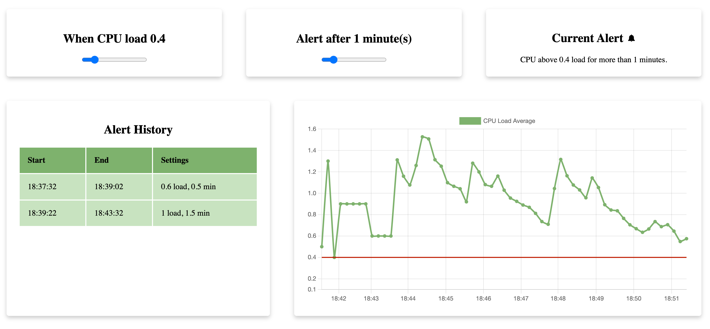

# Challenge Description
Load Monitoring Web Application
Showcase your front-end skills by creating a proof-of-concept (POC) for a browser-based CPU load monitoring application. This application will display time-series data, you're in charge of shaping the visual design of your application.

A user should be able to view your application to answer the following questions about their computer:

- What is my computer's current average CPU load?
- How did the average CPU load change over a 10 minute window?
- Has my computer been under heavy CPU load for 2 minutes or more? When? How many times?
- Has my computer recovered from heavy CPU load? When? How many times?

### Product requirements:
- The front-end application should communicate with a local back-end service to retrieve CPU load average information from your computer (see below).
- The front-end application should retrieve CPU load information every 10 seconds.
- The front-end application should maintain a 10 minute window of historical CPU load information.
- The front-end application should alert the user to high CPU load.
- The front-end application should alert the user when CPU load has recovered.

### Engineering requirements:

- The alerting logic in your application should have tests.
- The back-end service does not need to persist data.
- Please write up a small explanation of how you would extend or improve your application design if you were building this for production.

### CPU Load Average

Learn about CPU load here: https://en.wikipedia.org/wiki/Load_%28computing%29

Modern computers often have multiple CPUs, and you will need to normalize the load average to account for this. For example, on macOS or linux using NodeJS you could get the number of CPUs on your computer with:

`const cpus = os.cpus().length`

You could then normalize the CPU load average with:

`const loadAverage = os.loadavg()[0] / cpus`

On Windows there are packages available to provide this information to your application.

Thresholds for high load and recovery:

- A CPU is considered under high average load when it has exceeded 1 for 2 minutes or more.
- A CPU is considered recovered from high average load when it drops below 1 for 2 minutes or more.

# Final Result

# Setup

Recommended node version: 16.14.0

Install dependencies

`npm i --prefix back-end`

`npm i --prefix front-end`

Run each project in a separate terminal or append an `&` at the end of each command

`npm run start --prefix front-end`

`npm run start --prefix back-end`

# Architecture
## Folder Structure

I have decided to completely separate the front-end from the back-end.
This allows for better separation in terms of teams and tech stack in the future. (Assuming the API doesnt change ofc).

The remaining folder structure is what is given by fastify cli and cra cli so I used their templates as examples.

## API

I decided to create a separate metrics API endpoint on the back-end which can
pave the way for more different metrics if need be.

The API is currently very simple with just the cpu load average formula given
in the problem description.

I have decided that the measurements timestamp should also come from the server
since this gives a more accurate representation of when exactly the measurement
happened.

## Store

The main chunk of the logic lives in the store.
I decided to let the store handle the pooling with a separate action
giving also the ability to stop the pooling.

The main alerting logic is also done on the store per each request.
I would have liked to have some more separation here to be honest.
The code can be a bit more complex to reason about because there are different states that the store can be in per each cpu request.

## Components

I decided to use a mixture of scss and modules to get the best of both worlds.
I am not sure if this is what everyone uses now a days but I think it created a nice separation, even though styled components would probably be better.
I decided to use very basic css (e.g. no frameworks) on purpose. I also decided to be as semantic as I could in terms of HTML.

## Alerting

I only throw an alert when the timestamp is equal or more than the provided alert delta.
Every time the user decides to change the alert or threshold configuration I reset the current alerts.
I also only count an alert to its log history after it has resolved.
Hence if the CPU exceeds the threshold for 10 minutes it will still only count as one "incident" and not 10 / alertDeltaMinutes incidents.

## Tests

I tried to make the tests as more integration as I could without mocking anything.
The exception is of course ChartJS and the setInterval pooling logic.
I tried to get a full integration test working but I couldn't do it.
I even installed sinon fake timers but I just couldn't get a working example going.
Although the code coverage is not too high, and not everything was tested.
I think the most important features were tested.
The most important test is being done on Notification.test.tsx.

## Production Readiness

The code can always be improved.
I could have a better more separate folder structure. More catchy UI/UX. Better time display handling (0.5 minutes).
Probably handle some edge cases around the timestamps being exact giving room for a small epsilon timestamp to its not exact.
The back-end of course in production could not be used because that would assume the user would have a server running.
